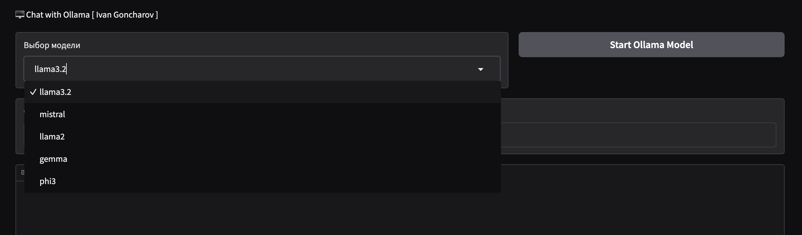

### Nikiforov test app - Веб интерфейс для чат ботов. 

#### Опции:
- GUI или веб интерфейс - приложение в котором можно выбрать нужную модель и стартануть ИИ модель для генерации чат бота. 
И далее поболтать с тензорным другом...

--- 

- Кнопка пуск и панель для выбора модели ollama.
GUI или веб интерфейс - приложение в котором можно выбрать нужную модель и стартануть ИИ модель для генерации чат бота.

- Окно чата с хpонологией сообщений. Что пишем то и видим. Есть кнопка отправить для отправки сообщений к нейроному собеседнику.

---

### Запуск приложения:

> [!NOTE]
> Этот тип запуска подходит для UNIX подобных систем [ Linux / Mac OS ]
> У вас должен быть установлен Docker + Docker Desktop

- Клонируйте репозиторий себе на компьютер в директорию где вы будете держать ваш проект `git clone https://github.com/ivanIStereotekk/niki4.git`

- Перейдите в директорию с проектом  `cd Nikiforov`

- Запустите сборку приложения командой `docker compose up`

- Дождитесь сборки, о чем появится сообщение в консоли `Running on local URL:  http://0.0.0.0:8000`, перейдите по этому  url удерживая Ctrl.

- Наслаждайтесь !

#### Политика конфиденциальности:

- Сбор данных
Бот не собирает и не хранит персональные данные пользователей. Запросы и ответы обрабатываются анонимно.

- Использование данных
Вся информация, предоставляемая пользователем, используется исключительно для формирования ответа в рамках функционала бота.

- Защита данных
Мы принимаем технические меры для защиты данных, чтобы предотвратить их утечку или несанкционированное использование.

- Ограничение ответственности
Разработчики бота не несут ответственности за возможные последствия использования информации, полученной через данный бот.

--- 
### Технологический стек:
- Python
- Gradio
- Ollama
- Docker

> [!NOTE]
> Тестовая работа для вакансии бекенд разработчик.

---

> [!WARNING]
> Это приложение тестировалось и разрабатывалось на платформе Mac OS.